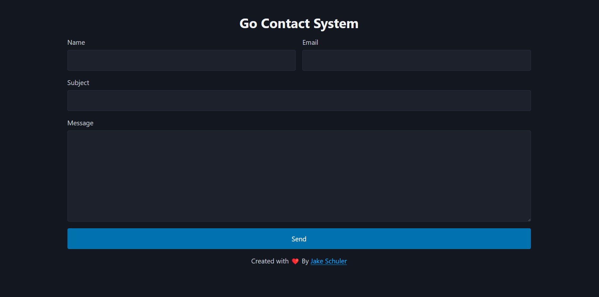

# Go Contact System
### A simple contact system to hide your email
Go Contact System is written to be a single binary with a .env file, so the `index.html` and `gopher.svg` (the favicon) are all bundled into the binary.

## How to run:
You can either deploy using docker or run the binary as a service
#### Docker:
Assuming you have wget and docker compose installed you can run these commands:
```
mkdir gocontactsystem && cd gocontactsystem # create and enter the directory
wget https://raw.githubusercontent.com/Jake-Schuler/GoContactSystem/refs/heads/main/example.env && wget https://raw.githubusercontent.com/Jake-Schuler/GoContactSystem/refs/heads/main/example.compose.yml # download example files
mv example.compose.yml compose.yml # rename compose
mv example.env .env # rename .env
nano compose.yml # edit compose if needed
nano .env # edit env
docker compose up -d || sudo docker compose up -d # start the compose
```
#### Binary:
Assumming you have git & Go installed run these:
```
git clone https://github.com/jake-schuler/GoContactSystem
go build
```
Then edit then rename the `example.env` to `.env` make your changes and run the binary.

Screenshot
